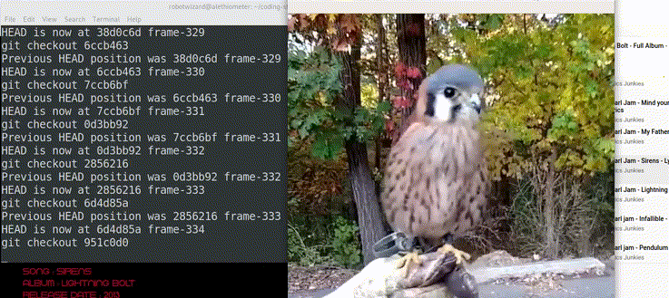

# Git powered video player

#### Imagine...if all you had to do to watch a movie was clone a repo.

* Checkout to release to see the final version of the movie.
* Checkout to develop to see the director's cut :P
* Watch a movie Bandersnatch style by checking out to different trees in the history
* Watch bloopers in bugfix/reverted-some-changes

<span style="font-size:10px">Well all that hasn't happened yet, what you see here is just the first step</span>

Starting with the first frame of the movie, each new frame is a commit in the repository.

This is the end result of _git checkout_-ing very fast through all the frames

👀



```python
# commit frame by frame
python3 git-it.py birb.mp4

# checkout and play frame by frame
python3 play-commits.py
```


#### pre-requisites
1. ffmpeg
2. git
